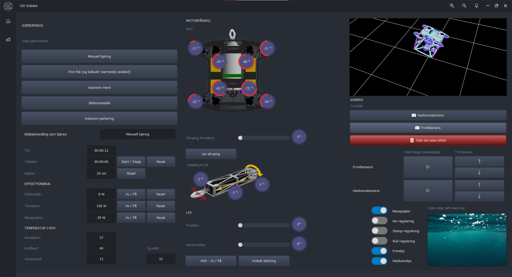
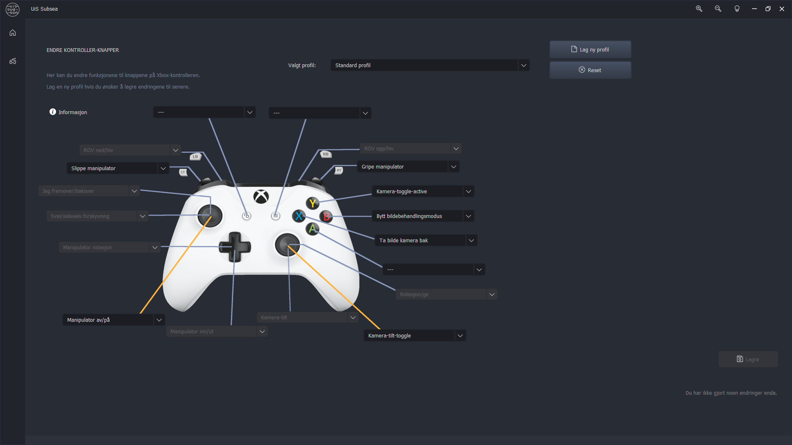
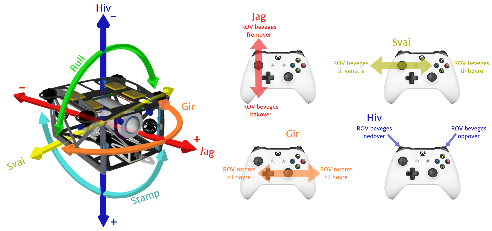
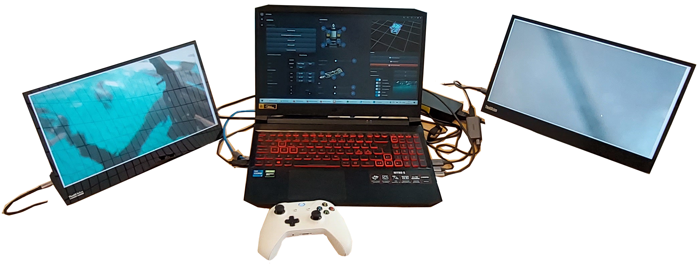

# UiS Subsea - ROV Topside System
#### DATBAC-1 21H - Bacheloroppgave i datateknologi
This project is made to be run on the topside system of the UiS Subsea ROV <a href="https://www.uissubsea.no/past-drones/fenris">Fenris</a>
<br>
This program consist of:
* The GUI for showing sensordata
* Network handler for receiving sensordata and sending commands
* Handler for getting input from a controller
<br>
<br>
<hr>




<hr>
<br>

### How to install
Installing is done by (assumes that you have Python 3.10 and pip installed and added to path):

* Download the project.
* Make sure VLC is installed on your computer. https://www.videolan.org/
* To install all the required Python libraries run:
```
pip install -r requirements.txt
```
* Open port 6900 for TCP communication both receiving and sending.
* Start the program by running:
```
python main.py
```
After both systems are running, the camera feeds from the ROV can be seen by opening the links <a href="http://10.0.0.2:6888/cam.html">Camera 1</a> <a href="http://10.0.0.2:6889/cam.html">Camera 2</a> 